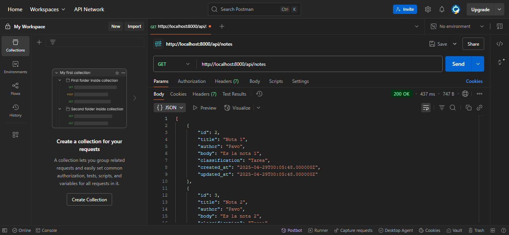
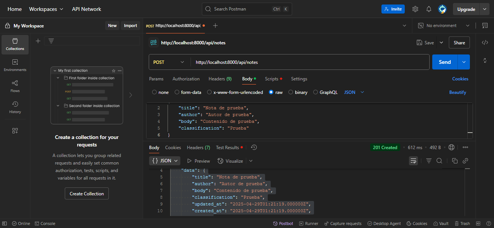
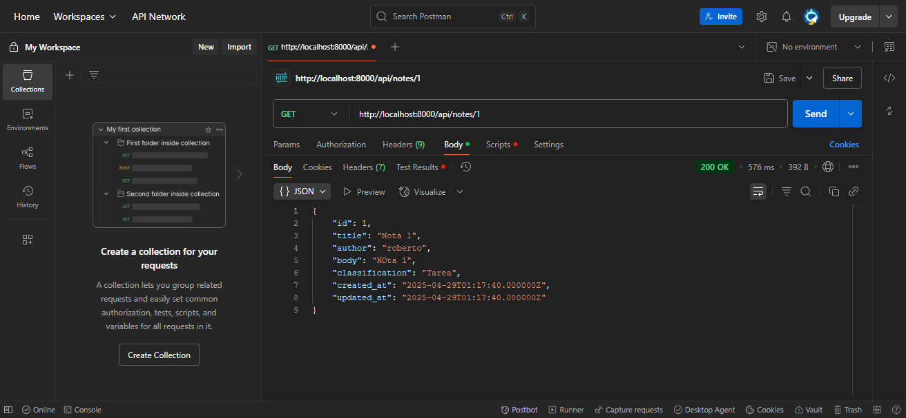
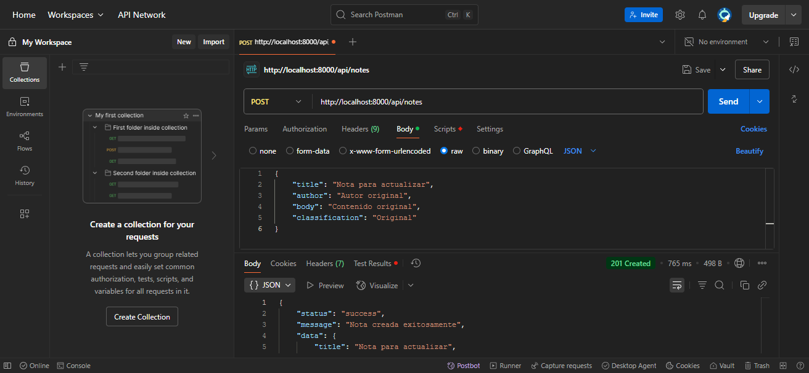
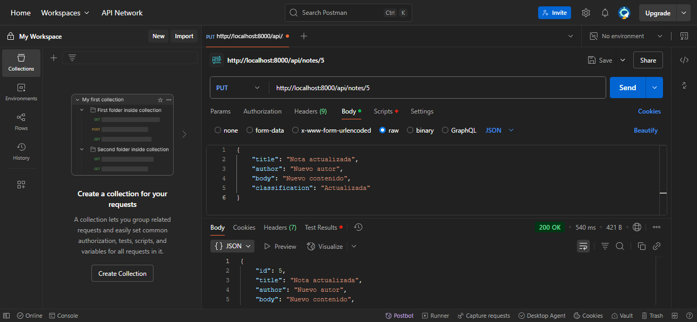
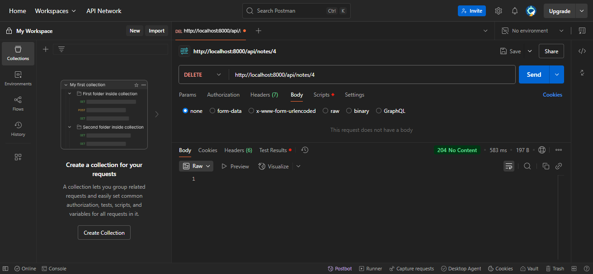

# API de Notas Personales

Este proyecto es una aplicación Laravel para gestionar notas personales a través de una API RESTful. Permite a los usuarios crear, leer, actualizar y eliminar notas. Cada nota contiene un título, autor, fecha y hora, cuerpo y clasificación.

## Instrucciones de Instalación

1. Clonar el repositorio:
```bash
git clone https://github.com/tu-usuario/personal-notes-api.git
```

2. Instalar dependencias:
```bash
composer install
```

3. Configurar variables de entorno:
Crear un archivo `.env` en el directorio raíz y agregar:
```
DB_CONNECTION=mysql
DB_HOST=127.0.0.1
DB_PORT=3306
DB_DATABASE=nombre_de_tu_base_de_datos
DB_USERNAME=tu_usuario
DB_PASSWORD=tu_contraseña
```

4. Ejecutar las migraciones:
```bash
php artisan migrate
```

5. Iniciar el servidor:
```bash
php artisan serve
```

El servidor se ejecutará en: `http://localhost:8000`

## Endpoints de la API

### 1. Obtener todas las notas (GET)
- **URL**: `http://localhost:8000/api/notes`
- **Método**: GET
- **Headers**:
  - Accept: application/json
  - Content-Type: application/json
- **Respuesta exitosa**:
```json
[
    {
        "id": 1,
        "title": "Título de la nota",
        "author": "Nombre del autor",
        "body": "Contenido de la nota",
        "classification": "Clasificación",
        "created_at": "2024-04-28T12:00:00.000000Z",
        "updated_at": "2024-04-28T12:00:00.000000Z"
    }
]
```

### 2. Crear una nueva nota (POST)
- **URL**: `http://localhost:8000/api/notes`
- **Método**: POST
- **Headers**:
  - Accept: application/json
  - Content-Type: application/json
- **Body**:
```json
{
    "title": "Nota de prueba",
    "author": "Autor de prueba",
    "body": "Contenido de prueba",
    "classification": "Prueba"
}
```
- **Respuesta exitosa**:
```json
{
    "status": "success",
    "message": "Nota creada exitosamente",
    "data": {
        "id": 1,
        "title": "Nota de prueba",
        "author": "Autor de prueba",
        "body": "Contenido de prueba",
        "classification": "Prueba",
        "created_at": "2024-04-28T12:00:00.000000Z",
        "updated_at": "2024-04-28T12:00:00.000000Z"
    }
}
```

### 3. Obtener una nota específica (GET)
- **URL**: `http://localhost:8000/api/notes/{id}`
- **Método**: GET
- **Headers**:
  - Accept: application/json
  - Content-Type: application/json
- **Respuesta exitosa**:
```json
{
    "id": 1,
    "title": "Nota de prueba",
    "author": "Autor de prueba",
    "body": "Contenido de prueba",
    "classification": "Prueba",
    "created_at": "2024-04-28T12:00:00.000000Z",
    "updated_at": "2024-04-28T12:00:00.000000Z"
}
```

### 4. Actualizar una nota (PUT)
- **URL**: `http://localhost:8000/api/notes/{id}`
- **Método**: PUT
- **Headers**:
  - Accept: application/json
  - Content-Type: application/json
- **Body**:
```json
{
    "title": "Nota actualizada",
    "author": "Nuevo autor",
    "body": "Nuevo contenido",
    "classification": "Actualizada"
}
```
- **Respuesta exitosa**:
```json
{
    "id": 1,
    "title": "Nota actualizada",
    "author": "Nuevo autor",
    "body": "Nuevo contenido",
    "classification": "Actualizada",
    "created_at": "2024-04-28T12:00:00.000000Z",
    "updated_at": "2024-04-28T12:30:00.000000Z"
}
```

### 5. Eliminar una nota (DELETE)
- **URL**: `http://localhost:8000/api/notes/{id}`
- **Método**: DELETE
- **Headers**:
  - Accept: application/json
  - Content-Type: application/json
- **Respuesta exitosa**: Código 204 (No Content)

## Capturas de Pantalla de Postman

### 1. GET todas las notas


### 2. POST crear nota


### 3. GET nota específica


### 4. PUT antes de actualizar nota


### 5. PUT actualizar nota


### 6. DELETE eliminar nota


## Estructura de una Nota

```json
{
    "title": "Título de la nota",
    "author": "Nombre del autor",
    "date_time": "2024-04-28 12:00:00",
    "body": "Contenido de la nota",
    "classification": "Clasificación de la nota"
}
```

<p align="center"><a href="https://laravel.com" target="_blank"></a></p>

<p align="center">
<a href="https://github.com/laravel/framework/actions"></a>
<a href="https://packagist.org/packages/laravel/framework"></a>
<a href="https://packagist.org/packages/laravel/framework"></a>
<a href="https://packagist.org/packages/laravel/framework"></a>
</p>

## About Laravel

Laravel is a web application framework with expressive, elegant syntax. We believe development must be an enjoyable and creative experience to be truly fulfilling. Laravel takes the pain out of development by easing common tasks used in many web projects, such as:

- [Simple, fast routing engine](https://laravel.com/docs/routing).
- [Powerful dependency injection container](https://laravel.com/docs/container).
- Multiple back-ends for [session](https://laravel.com/docs/session) and [cache](https://laravel.com/docs/cache) storage.
- Expressive, intuitive [database ORM](https://laravel.com/docs/eloquent).
- Database agnostic [schema migrations](https://laravel.com/docs/migrations).
- [Robust background job processing](https://laravel.com/docs/queues).
- [Real-time event broadcasting](https://laravel.com/docs/broadcasting).

Laravel is accessible, powerful, and provides tools required for large, robust applications.

## Learning Laravel

Laravel has the most extensive and thorough [documentation](https://laravel.com/docs) and video tutorial library of all modern web application frameworks, making it a breeze to get started with the framework.

You may also try the [Laravel Bootcamp](https://bootcamp.laravel.com), where you will be guided through building a modern Laravel application from scratch.

If you don't feel like reading, [Laracasts](https://laracasts.com) can help. Laracasts contains thousands of video tutorials on a range of topics including Laravel, modern PHP, unit testing, and JavaScript. Boost your skills by digging into our comprehensive video library.

## Laravel Sponsors

We would like to extend our thanks to the following sponsors for funding Laravel development. If you are interested in becoming a sponsor, please visit the [Laravel Partners program](https://partners.laravel.com).

### Premium Partners

- **[Vehikl](https://vehikl.com/)**
- **[Tighten Co.](https://tighten.co)**
- **[Kirschbaum Development Group](https://kirschbaumdevelopment.com)**
- **[64 Robots](https://64robots.com)**
- **[Curotec](https://www.curotec.com/services/technologies/laravel/)**
- **[DevSquad](https://devsquad.com/hire-laravel-developers)**
- **[Redberry](https://redberry.international/laravel-development/)**
- **[Active Logic](https://activelogic.com)**

## Contributing

Thank you for considering contributing to the Laravel framework! The contribution guide can be found in the [Laravel documentation](https://laravel.com/docs/contributions).

## Code of Conduct

In order to ensure that the Laravel community is welcoming to all, please review and abide by the [Code of Conduct](https://laravel.com/docs/contributions#code-of-conduct).

## Security Vulnerabilities

If you discover a security vulnerability within Laravel, please send an e-mail to Taylor Otwell via [taylor@laravel.com](mailto:taylor@laravel.com). All security vulnerabilities will be promptly addressed.

## License

The Laravel framework is open-sourced software licensed under the [MIT license](https://opensource.org/licenses/MIT).
